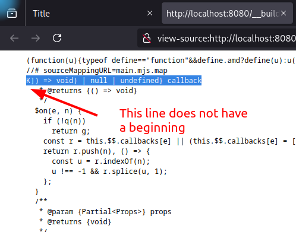

# Repo for reproducing error with js build output

Hello, this project is to reproduce issue when building this project.

The following screenshot depicts the error:

I observed that the error is tied to the presence of `--watch` CLI switch which enables file changes watch.

## Steps to reproduce
- `npm i`
- `npm run dev-server` (starts dev server and HTTP server in output dir)
- Navigate to `http://localhost:8080`
- Observe output
  - **3** apps should be rendered for the build to be successful
  - less than **3** means that at least one app has corrupted output (see devtools console for hints)

## Successful approach
- `npm i`
- `npm run build` (starts dev server and HTTP server in output dir)
- `live-server ./output` and 
- Navigate to `http://localhost:8080`
- Observe output: **3** apps should be rendered
